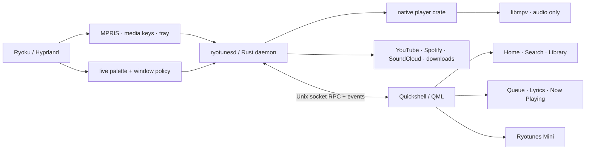

<div align="center">


<br />

<a href="https://github.com/ryoku-dev/ryotunes/releases/latest"></a>
<a href="LICENSE"></a>


<br />


<br /><br />

**A Ryoku-native desktop music player with native audio playback, live shell theming, and a UI that knows when to disappear.**

[Download](https://github.com/ryoku-dev/ryotunes/releases/latest) · [Architecture](docs/ARCHITECTURE.md) · [Install](docs/INSTALL-ARCH.md) · [Troubleshooting](docs/TROUBLESHOOTING.md) · [Ryoku](https://github.com/ryoku-dev/ryoku-arch)

</div>

<br />


<p align="center"><sub>Repository artwork based on the live v2 Home layout and Ryoku visual language.</sub></p>

### The primary client: Quickshell / QML

**The QML client is the primary Ryotunes application.** It includes the YouTube,
Spotify and SoundCloud provider selector, downloads, and Settings → About
software-update controls. The Tauri/WebKitGTK interface is the legacy client,
not its replacement. Package version numbers alone do not identify the client:
the release package currently contains both.

To update an existing installation, download the Arch package and matching
checksum from [the latest release](https://github.com/ryoku-dev/ryotunes/releases/latest).
Verify it before changing the installed application:

```bash
sha256sum -c ryotunes-1.0.1-1-x86_64.pkg.tar.zst.sha256
```

Use the filenames for your downloaded release and continue only on `OK`.
Quit Ryotunes completely, then replace the package in one transaction; there is
no need to uninstall the primary QML application first:

```bash
systemctl --user stop ryotunesd.service ryotunesd.socket
sudo pacman -U ./ryotunes-1.0.1-1-x86_64.pkg.tar.zst
systemctl --user daemon-reload
systemctl --user enable --now ryotunesd.socket
ryotunes
```

The package's `1:` pacman epoch orders `1:1.0.1-1` above distribution-numbered
builds such as `2.5.1-1`; it does not mean QML is obsolete. Personal configuration
and music are preserved. If pacman reports file conflicts, check ownership with
`pacman -Qo /path/to/file` and back up unowned files before retrying. Do not use
blanket `--overwrite` or bypass dependency checks with `-Rdd`.

**If the legacy interface opens:** quit it, then restart socket activation:

```bash
systemctl --user restart ryotunesd.socket
systemctl --user start ryotunesd.service
ryotunes-cli show
```

The launcher can fall back to Tauri when the daemon socket is missing or refuses
connections. Verify **Settings → About → Client: QUICKSHELL / QML**, the provider
selector and Downloads sidebar rather than judging the client by its version.
Check for updates from that QML About page.

To remove Ryotunes entirely instead of updating it, quit the app and run
`sudo pacman -R ryotunes`. This removes both packaged clients, not just Tauri;
do not use it to remove the legacy interface while keeping QML.


---

## Built for Ryoku, not merely compatible with it

Ryotunes is a Linux-first desktop music application shaped around the way **Ryoku + Hyprland** actually behave.

The primary interface is Quickshell / QML, connected to the Rust `ryotunesd` daemon. Rust and libmpv own playback, media state and provider integrations independently of the visible client. The older Svelte/WebKitGTK interface remains a separate legacy launch mode.

<table>
<tr>
<td width="33%" valign="top">

### Native where it matters
Audio stays in **libmpv**, outside the frontend renderer. MPRIS, media keys, tray controls, gapless playback and the active session remain native.

</td>
<td width="33%" valign="top">

### Ryoku in real time
**Follow System** consumes Ryoku's live Material-role palette. Named themes and wallpaper-derived colours retint both the main window and mini-player immediately.

</td>
<td width="33%" valign="top">

### Quiet in the background
The QML window can close while the daemon continues playback or active downloads.

</td>
</tr>
</table>

> [!NOTE]
> Ryotunes is intentionally **audio-only**. It does not provide music-video playback.

---

## The experience

| Surface | What Ryotunes does |
|---|---|
| **Home** | Resume listening, remembered songs/albums/playlists, searchable shortcuts and local discovery ranking without the first-scroll jump |
| **Search** | Songs, albums, artists and playlists with bounded incremental loading and preserved navigation state |
| **Library** | Liked music, account playlists, persistent device playlists and local music in the same desktop flow |
| **Radio** | Demand-driven Internet Radio directory with native libmpv live-stream playback |
| **Now Playing** | Artwork-first playback surface with queue, metadata and lyrics access |
| **Lyrics** | Synced lyrics with click-to-seek and mini-player follow mode |
| **Queue** | Manual queue control plus radio / continuation behaviour |
| **Downloads (native client)** | One-click audio downloads beside the heart, a bounded background queue, persistent history and configurable file preferences |
| **Mini-player** | A separate compact Ryoku surface with its own exact Hyprland title and independent geometry |
| **Integrations** | MPRIS, hardware media keys, tray, Last.fm, configurable Discord Rich Presence and optional Listen Together |

### Home in the primary QML client

- **Continue listening** resumes the queue restored by the daemon; reopening does not start playback automatically.
- **Recently played** remembers songs, albums and playlists across launches. Items already saved as shortcuts are not repeated in that row.
- **Add shortcut** lets you filter recents and your library, search the selected provider, or paste a YouTube / YouTube Music playlist link. A link is previewed with its real title and artwork before you add it. Private or unavailable playlists show an error; duplicate shortcuts are not added.
- **Picked for you** re-ranks the selected provider's existing Home feed using local listening history, recency and artist variety. With no relevant history, it uses the provider's discovery ordering instead of claiming learned preferences. This adds no recommendation API, paid service or background training: at most 300 candidates are considered for 12 picks, only when the feed or personal data changes. Displaying additional artwork still has a memory cost.

---
## Download music in the native client

Click the **download arrow beside the heart** in the player to start saving the current track immediately. The icon shows progress, then a check mark when the file is saved. Clicking an active or completed download opens **Downloads** in the sidebar; failed and cancelled downloads can be retried.

To save an entire album, open its **⋯ menu → Download album**. This queues all downloadable tracks in album order, including any additional pages, regardless of the track filter. It uses the same saved preferences and worker limit as single-track downloads. The confirmation reports how many tracks are in Downloads and any unavailable tracks; a queue or connection error reports partial progress rather than claiming the whole album was added. Spotify albums still use labelled YouTube matches, not Spotify audio exports.

**Settings › Downloads** controls the destination folder, Original / MP3 / Opus format, artist subfolders, embedded cover art & lyrics, and simultaneous workers. The default destination is your XDG Music folder's `Ryotunes/` directory (usually `~/Music/Ryotunes`), with original audio and **one worker**. You can choose up to four workers; additional tracks wait in a queue capped at 200. Save preferences explicitly. File preferences are captured when a track is queued; changing the worker limit changes admission immediately without interrupting running jobs.

The Downloads page separates the live queue from the latest 200 history records, with cancel, retry and open-folder actions. Closing the window leaves downloads running. Quitting Ryotunes terminates and reaps its downloader workers; interrupted jobs remain in history for an explicit retry after restart. Clearing history never deletes music, and existing files are never overwritten.

With **Embed cover art & lyrics** on (the default), downloads embed available artwork and plain lyrics where the audio format supports them, and save matching `.jpg`/`.png` artwork plus synced `.lrc` or plain `.txt` lyrics alongside the song. Ryotunes reads local `.lrc`, embedded lyrics, then `.txt` before consulting its network cache/providers, so saved lyrics work offline. Artwork uses the track thumbnail with a name-and-artist iTunes lookup fallback; lyrics reuse the existing providers, including LRCLIB. These services receive track metadata such as title, artist, duration and provider identifiers. Missing matches produce a non-fatal history note rather than failing the audio download. Existing songs are not backfilled or overwritten; download them again to add metadata.

Downloads require **yt-dlp and FFmpeg** (included in the native source package's dependencies). YouTube and public SoundCloud tracks use their source links. **Spotify uses a labelled YouTube search match**, not an export of the Spotify stream, and the matched recording may differ. Local files, live radio, DRM-protected and unavailable tracks are not downloadable. Only download music you have permission to save.


## Ryoku integration

Ryotunes does not implement a disconnected theme layer and then approximate Ryoku on top of it. The Linux build integrates with the shell directly.

- **Live palette bridge** — Rust resolves Ryoku Material roles and watches Ryoku theme sources with inotify.
- **Immediate theme updates** — no 60-second frontend palette polling loop.
- **Compositor-owned startup geometry** — the main surface is floated, sized and centred by the Ryoku/Hyprland rule before it becomes visible.
- **Mini-player isolation** — the main rule matches the exact title `^(Ryotunes)$`; `Ryotunes Mini` remains independent.
- **MPRIS continuity** — Ryoku media controls remain available when the visible main UI is closed.
- **Rollback-safe replacement packaging** — custom Ryotunes replaces only the stock Ryotunes entry points, never `ryoku-desktop`.

### Skins

Every colour, type face, radius and duration the chrome reads comes from one **skin**. The default, `system`, follows the Ryoku desktop live (wallpaper palette, named scheme, motion scale, decor). The `matugen` skin is the same manifest written by a matugen template from your wallpaper — on Ryoku it is one of the *Theme apps*, regenerated on every palette change. Any folder with a `skin.json` is a skin, and editing it re-paints the running app:

```
/usr/share/ryotunes/skins/<id>/        shipped: paper, ember, mist
~/.config/ryotunes/skins/<id>/         yours (shadows a shipped id); skins/matugen is the generated one
/usr/share/ryotunes/matugen/ryotunes.json   the matugen template
```

Pick one in *Settings › Appearance*, or **Get more skins** there — that opens [RyoStore](https://github.com/ryoku-dev/ryostore) on its *Ryotunes skins* category, and an install lands in `~/.local/share/ryoku/ryotunes-skins/<id>/`. To make your own: fork the painted palette with **New skin from current**, validate with `ryotunes-cli skin check <dir>`, and submit it to the store catalogue as `ryotunes-skins/<id>/` — the format and the checklist are in **[docs/SKINS.md](docs/SKINS.md)**.

For the shell itself:

**[Ryoku Arch](https://github.com/ryoku-dev/ryoku-arch)** · **[Ryoku Discord](https://discord.gg/8KjBmUEyKA)**

---

## A small lifecycle contract with a big payoff

| Situation | Behaviour |
|---|---|
| Main window open | The primary Quickshell / QML client is connected to the daemon |
| Close while music or downloads are active | The daemon continues the active work |
| Idle with no client | The daemon exits after its idle grace period |
| Reopen | The QML client reconnects to daemon-owned state |
| Explicit **Quit** | Playback stops, MPRIS unregisters, media state clears and backend integrations shut down |

This is why the UI is a **client of playback state**, not the transport clock that owns it.

---

## Architecture



More detail: **[docs/ARCHITECTURE.md](docs/ARCHITECTURE.md)**

---

## Performance is part of the product

Ryotunes treats background efficiency as an architectural requirement, not a cleanup pass.

- event-driven playback state instead of a permanent 100 ms global frontend transport timer;
- daemon-owned playback and downloads independent of the visible QML window;
- bounded artwork decode/cache paths;
- native playback state remains authoritative across close, tray, mini-player and reopen transitions;
- Internet Radio discovery is demand-driven — no startup fetch or permanent station polling loop.

The design rules behind the interface are documented in **[docs/DESIGN.md](docs/DESIGN.md)**.

---

## Install

Fedora 44 x86_64: [RPM installation and build instructions](docs/INSTALL-FEDORA.md).
The Fedora package preserves the primary QML client and uses DNF-managed updates.


Ryotunes targets **x86_64 Ryoku, CachyOS and Arch-based systems**.

The published package is **`ryotunes 1:<version>-1`**. Its permanent `epoch=1` orders it above distribution-numbered 2.x packages; filenames stay epochless. This numbering transition is not a switch from QML to Tauri.

The normal user path is a **prebuilt package**. End users do not need Node, pnpm, Rust or Cargo.

1. Open **[GitHub Releases](https://github.com/ryoku-dev/ryotunes/releases/latest)**.
2. Download `ryotunes-<version>-1-x86_64.pkg.tar.zst` and its `.sha256`.
3. Verify and install:

```bash
sha256sum -c ryotunes-<version>-1-x86_64.pkg.tar.zst.sha256
sudo pacman -U ./ryotunes-<version>-1-x86_64.pkg.tar.zst
```

The package installs `/usr/bin/ryotunes`, `ryotunesd`, `ryotunes-cli` and the primary QML client under `/usr/share/ryotunes`. Follow the update and socket-activation instructions above when replacing an existing installation.

> [!TIP]
> An AUR `-bin` recipe lives in [`aur/`](aur/). Public AUR publication is pending; the repository does not pretend the package is available there before it actually is.

Source/development setup: **[docs/INSTALL-ARCH.md](docs/INSTALL-ARCH.md)**

---

<details>
<summary><b>Repository map</b></summary>

```text
crates/
  innertube/          YouTube Music request/model layer
  player/             native playback core
  listen-protocol/    shared Listen Together protocol
  sync-server/        optional room relay

client/                primary Quickshell / QML interface
crates/ryotunesd/       playback daemon, provider RPC and downloads
src-tauri/             legacy Tauri host
ui/                    legacy Svelte / WebKitGTK interface
integrations/          Ryoku / shell integration assets
packaging/             Arch / Ryoku replacement packaging
scripts/               diagnostics, release gates and packaging tools
docs/                  architecture, install, design and troubleshooting
aur/                   binary AUR recipe sources
```

</details>

<details>
<summary><b>Development & validation</b></summary>

The dependency graphs are locked. Release work is expected to pass both frontend and native gates.

```bash
cd ui
pnpm install --frozen-lockfile
pnpm check
pnpm build

cd ..
cargo fmt --all -- --check
cargo test --workspace --locked
cargo check --workspace --locked
cargo tauri build --no-bundle
```

Release checklist: **[docs/RELEASE-CHECKLIST.md](docs/RELEASE-CHECKLIST.md)**

</details>

<details>
<summary><b>Troubleshooting</b></summary>

Start with **[docs/TROUBLESHOOTING.md](docs/TROUBLESHOOTING.md)**.

For a useful bug report, include:

- Ryoku / Hyprland version
- distro and kernel
- Wayland/display-server context
- GPU setup
- steps to reproduce
- bundled diagnostics output when relevant

</details>

---

## Contributing

Contributions are welcome when they preserve the product contracts that make Ryotunes feel native on Ryoku.

Start with **[CONTRIBUTING.md](CONTRIBUTING.md)**. Changes touching playback lifecycle, theme integration, Home rendering, background behaviour or replacement packaging deserve explicit regression testing.

---

## Upstream, license & independence

Ryotunes is a **GPL-3.0-or-later modified work derived from [SimoHypers/LiMusic](https://github.com/SimoHypers/limusic)**.

The project retains transparent upstream attribution while pursuing its own Ryoku-specific product direction, interface, lifecycle, performance architecture and packaging model. See **[UPSTREAM.md](UPSTREAM.md)** for the detailed note.

Ryotunes is independently developed and is **not affiliated with, authorized by, sponsored by, or endorsed by YouTube or Google**. YouTube and YouTube Music are trademarks of Google LLC.

Distributed under **[GPL-3.0-or-later](LICENSE)**.

---

<div align="center">

### Music, shaped for the Ryoku desktop.

<sub>Rust · Quickshell / QML · libmpv · Hyprland</sub>

</div>
